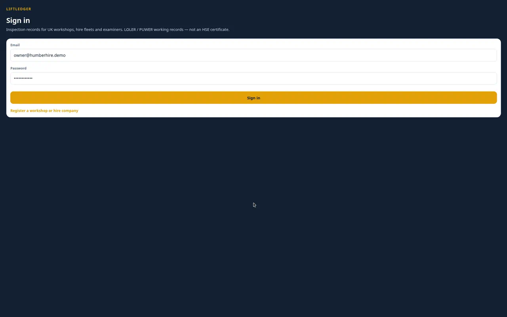
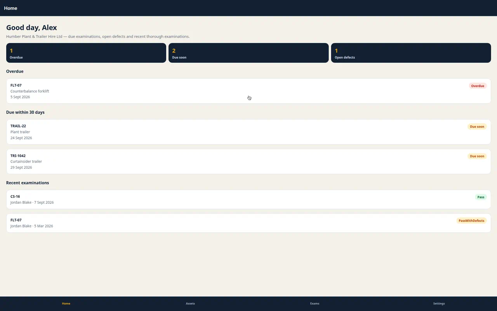
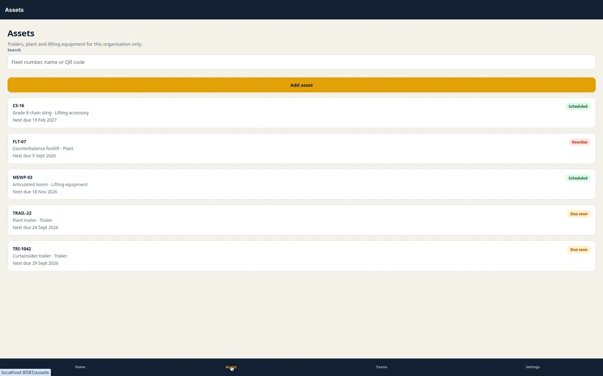
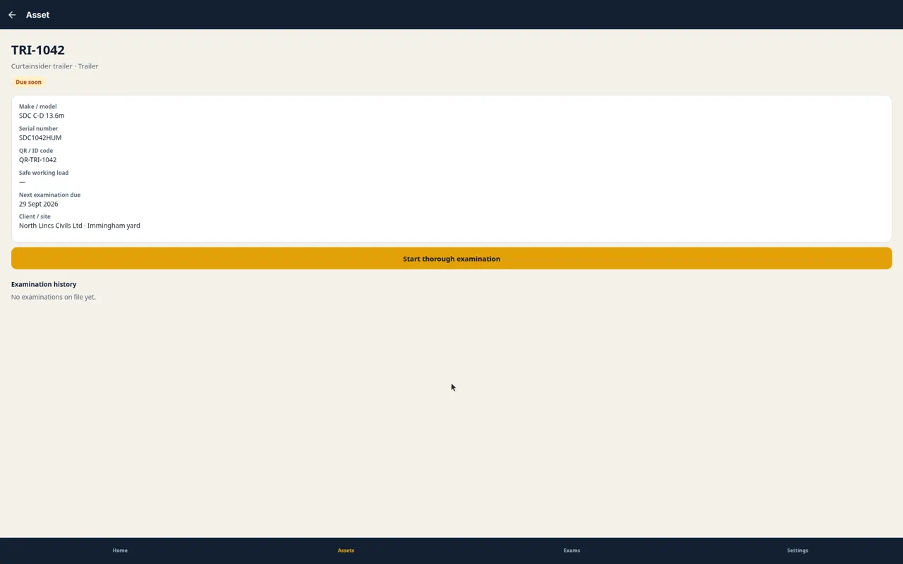
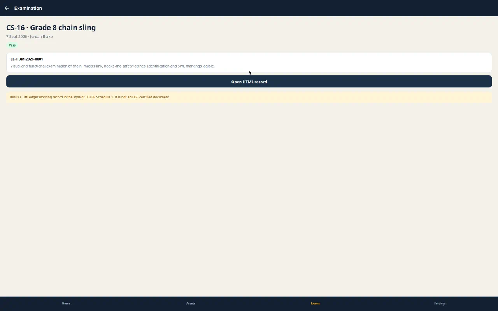
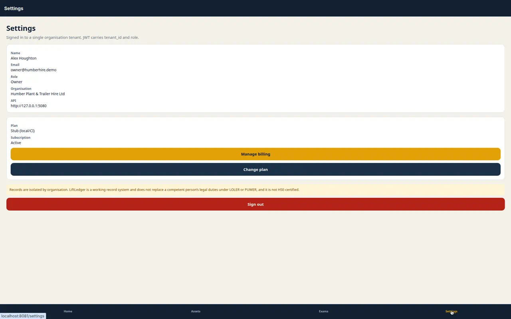

# LiftLedger UI screenshots

Captured from Expo web (`http://localhost:8081`) against the local API, signed in as Humber Hire owner `owner@humberhire.demo`. Settings uses stub billing (`SubscriptionApi:UseStub=true`).

| File | Screen |
|------|--------|
| [01-login.webp](01-login.webp) | Sign in |
| [02-home.webp](02-home.webp) | Home dashboard (overdue, due soon, recent examinations) |
| [03-assets.webp](03-assets.webp) | Assets list |
| [04-asset-detail.webp](04-asset-detail.webp) | Asset detail (TRI-1042 curtainsider trailer) |
| [05-examination.webp](05-examination.webp) | Completed examination (CS-16, Pass, record LL-HUM-2026-0001) |
| [06-settings.webp](06-settings.webp) | Settings with stub plan/status and Manage billing |
| [07-settings-billing.mp4](07-settings-billing.mp4) | Walkthrough: sign in → home → settings → Manage billing |

